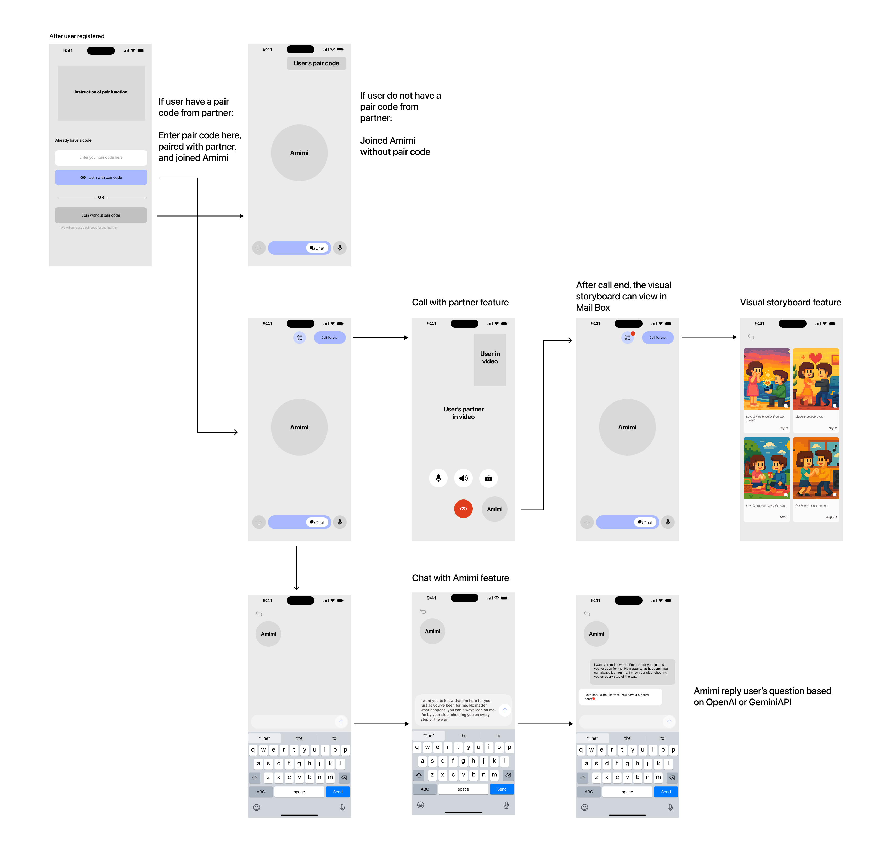

# Assignment 2: Functional Design

## Problem Statement

The domain I have chosen is long-distance relationships (LDR) and the challenge of sustaining love across physical separation. LDRs are often created by circumstances such as pursuing higher education, work relocation, or job requirements. I am drawn to this domain because of its strong social and emotional impact on young adults, particularly college students and early career professionals. According to 2023 statistics, over 14 million couples in the U.S.—about 28 million individuals—are in long-distance relationships. Moreover, 75% of engaged couples report having experienced long-distance at some stage, with 40% of these relationships ending in breakups, highlighting their fragility. More than 90% of these LDRs occur among people aged 18 to 30, an age group where individuals are forming identities, careers, and long-term commitments. This makes LDRs an important domain that intersects with both emotional well-being and future planning.

While falling in love can feel effortless, staying in love requires effort and consistent shared experiences. A key problem faced by couples in LDRs is the difficulty of maintaining "companionate love," a psychological concept describing love grounded in daily physical interaction, companionship, and shared routines. Companionate love helps couples develop trust, communication patterns, and shared long-term goals. In long-distance contexts, the absence of physical presence—such as touch, face-to-face interaction, and shared activities—creates barriers to building this foundation. In the short term, couples often experience misunderstandings, anxiety, and a lack of attention to each other's needs. For example, partners may feel uncertain about what the other is truly thinking after a call or may exchange photos of daily life that create parallel narratives rather than shared experiences. These short-term gaps weaken long-term relationship stability, leading to doubts about the future, difficulty making joint decisions, and increased emotional distress.

## Stakeholders List

- **Couples in LDRs**: The primary stakeholders who directly experience the emotional, psychological, and relational challenges of distance.
- **College Students and Young Professionals**: A high-risk group for LDRs, as relocation for school or work is common.
- **Mental Health Counselors and Therapists**: Professionals who often support individuals coping with LDR-related stress, loneliness, and depression.
- **Friends and Family Members**: Secondary stakeholders who provide emotional support or advice and may be indirectly affected by the struggles of someone in an LDR.

## Evidence and Comparables

- **Google Trends Report (2023)**: LDR was the top relationship problem searched in the U.S., demonstrating widespread concern.
- All the statistic mentioned above is cited from: [LDR 101](https://www.luvlink.com/blogs/news/surprising-long-distance-relationship-statistics-ldr-101?srsltid=AfmBOoq3ixXwUBPkOsm8MD0dPkRB-mo2dtPZZhdkmhJPGZMN8K0mT1U0)
- **Psychological Research on Companionate Love**: Relationship - Bridge to the Soul, Book by Christopher Moon, 2017
- **Psychological Research on Relationship**: Attached, Book by Amir Levine and Rachel S. F. Heller, 2010
- **College Counselor Interviews**: Silvia worked at The University of Melbourne and Julia worked at UCD
- **LDR Couples Interviews**: 4 couples in LDR right now or before, each interview about 20-30 mins
- **Comparable Applications**: Apps such as Between and Couple attempt to support intimacy in LDRs through private sharing spaces, while general tools like WhatsApp and Zoom provide communication infrastructure. However, these apps often lack features to recreate shared context and companionship, underlining the gap between existing solutions and the problem of sustaining companionate love.

## Application Pitch

**Amimi** is a companionship AI designed to help long-distance couples strengthen their connection by recreating the sense of shared presence that is often missing across distance. The motivation behind Amimi is simple: while falling in love is easy, staying in companionate love during long separations is difficult. Couples struggle with the absence of daily companionship—those small shared moments, conversations, and memories that build long-term trust and intimacy. Amimi aims to fill this gap by supporting couples with meaningful, context-aware interactions.

### Key Features

**1. Call Listener**  
Amimi joins couples' regular phone or video calls as a silent companion. By listening in, Amimi learns the context of conversations and dynamics between partners, ensuring that interactions afterward feel personalized. This helps mitigate misunderstandings and gives couples the sense that someone understands their relationship as a whole, not just as two individuals.

**2. Memory Storyboard**  
This feature transforms sweet moments from conversations into visualized storyboards after each call. Instead of letting important emotions fade, Amimi curates these memories into visual artifacts that couples can revisit together. This provides the missing "shared activities and memories" of companionate love, giving couples something tangible to celebrate and reflect on, which strengthens their emotional bond.

**3. Chat with Amimi**  
An AI chat function trained with professional relationship coaching data. Couples can turn to Amimi with questions about their future, worries about each other's situation, or conflicts that arise. Drawing on its contextual knowledge from listening and memory-making, Amimi provides tailored feedback and supportive suggestions, helping couples reduce anxiety about the future and feel more confident in their relationship journey.

Together, these features make Amimi more than a communication tool—it becomes a bridge for long-distance couples, helping them sustain love through companionship, memory, and guidance.

## Concept Designs for Amimi

### Concept PairWithPartner [User]

**Purpose:** allow two registered users to connect as a couple through a pairing process

**Principle:** a user generates a unique pairing code and shares it with their partner; once the code is entered, the two accounts are linked as a couple; the pair can be unlinked later if necessary

#### State
```
a set of Pairs with
    partner1: User
    partner2: User
    active: Flag
```

#### Actions
```
generateCode(user: User): (code: Code)
    effects create a new pairing code linked to this user

pair(user: User, code: Code): (pair: Pair)
    requires code is valid and unused
    effects create a new pair linking the two users and mark it active

unpair(pair: Pair)
    requires pair exists and is active
    effects set active to false
```

### Concept CallWithPartner [Pair]

**Purpose:** enable paired users to communicate via audio/video calls

**Principle:** partners can start a video call, toggle camera, microphone, and speaker settings, and end the call when finished

#### State
```
a set of Calls with
    pair: Pair
    active: Flag
    cameraOn: Boolean (for each user)
    micOn: Boolean (for each user)
    speakerOn: Boolean (for each user)
```

#### Actions
```
startCall(pair: Pair): (call: Call)
    effects create a new active call for the pair

toggleCamera(call: Call, user: User)
    requires call is active and user is in pair
    effects switch the camera state for the user

toggleMic(call: Call, user: User)
    same as toggleCamera but for microphone

toggleSpeaker(call: Call, user: User)
    same as toggleCamera but for speaker

endCall(call: Call)
    requires call is active
    effects mark call as inactive
```

### Concept AmimiListen [Call]

**Purpose:** capture context of couple conversations for personalization

**Principle:** while a call is ongoing, Amimi performs speech-to-text transcription and saves highlights of the conversation for later use

#### State
```
a set of Transcripts with
    call: Call
    user: User
    text: String
    timestamp: Time
```

#### Actions
```
startListening(call: Call)
    requires call is active
    effects begin recording and transcribing speech into text

stopListening(call: Call)
    requires call is active
    effects stop recording and save transcript
```

### Concept MemoryStoryboard [Transcript]

**Purpose:** create visual storyboards summarizing meaningful and happy moments from calls

**Principle:** after a call ends, Amimi processes transcripts, identifies "sweet moments," and generates a visual storyboard, which is stored in the couple's mailbox

#### State
```
a set of Storyboards with
    transcript: Transcript
    images: Set of Visuals
    owner: Pair
```

#### Actions
```
generateStoryboard(transcript: Transcript): (storyboard: Storyboard)
    requires transcript exists
    effects create storyboard images summarizing happy moments and link them to the pair's mailbox
```

### Concept ChatWithAmimi [User]

**Purpose:** allow any registered user to interact with Amimi as a relationship coach chatbot

**Principle:** users can send questions or concerns to Amimi, who responds with personalized feedback based on coaching data and the user's context

#### State
```
a set of Chats with
    user: User
    messages: Set of Messages
```

#### Actions
```
sendMessage(user: User, text: String): (message: Message)
    effects create a message from the user and add it to the chat

getResponse(message: Message): (reply: Message)
    requires message exists
    effects generate an AI response and append it to the chat
```

## UI Sketch



*Complete user flow showing the pairing process, call features with Amimi listening, memory storyboard generation, and chat functionality for the Amimi long-distance relationship app.*
